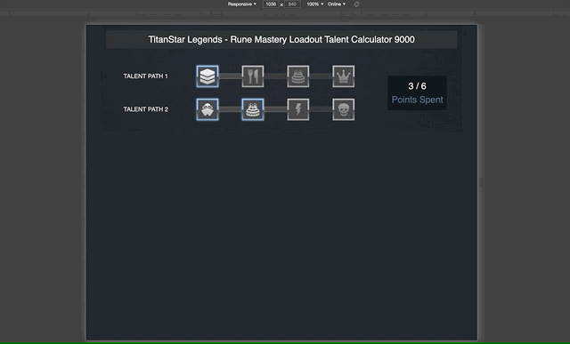

# Rune Mastery Loadout Talent Calculator 9000
## How to Run:
```
npm install
npm start
```

The app will be served from http://localhost:3000/

Left click runes to select them. Right click runes to deselect them (or long tap on mobile device).

## Responsive Design!


## State Management
This app uses React Redux for state management. See `src/state/Loadout.js`
